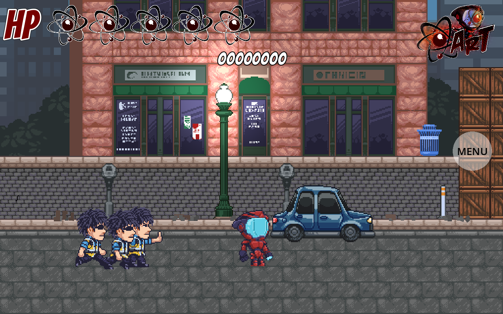

# Atomic Robot

A side-scrolling beat-'em-up set on a city street. You play a mascot of the Atomic Robot
tattoo shop, and the meter maids want a word.



## Play it

**[Play in your browser](https://severalherr.itch.io/atomic-robot)** — works on a phone
too, with on-screen buttons. No download, no account.

## How it plays

Walk down the street, punch meter maids, and don't run out of health.

- You can move **into and out of the screen**, not just left and right — four lanes of
  street, arcade style. You can only hit what shares your lane.
- **Five hearts** of health. Parked cars, thrown coins and fists all take a bite.
- **Combos** score more. Getting hit resets them.
- **Three playable characters**, unlocked as you go: Robot, Cody and Ryan.

## Controls

| Action | Key |
|---|---|
| Move | A D or arrows |
| Jump | Space |
| Attack | F |
| Use / interact | E |
| Run | Hold Shift |
| Step back / forward a lane | W or Up / tap S or Down |
| Crouch | Hold S or Down |
| Pause | Esc |

Pause opens volume, the CRT screen effect, and resume. On a phone, use the on-screen
joystick and buttons instead.

## Built with

[Godot 4.7](https://godotengine.org). Everything here is a normal Godot project — clone
it, open `project.godot` in the editor, and press F5 to play.

## For developers

- `CLAUDE.md` — how to build, run and test this project on a dev machine
- `docs/ARCHITECTURE.md` — scenes, autoloads, signals, state machines
- `docs/LEVELS.md` — how the street is built and where ground collision lives
- `docs/LANE_REFACTOR.md` — the four-lane depth system
- `docs/POWERUPS_AND_SCORE.md` — power-ups and scoring rules

Quick checks, no editor needed:

```bash
godot --headless --path . --script res://tools/lint_project.gd   # scene + resource lint
godot --headless --path . --script res://tools/run_tests.gd      # unit tests
```
